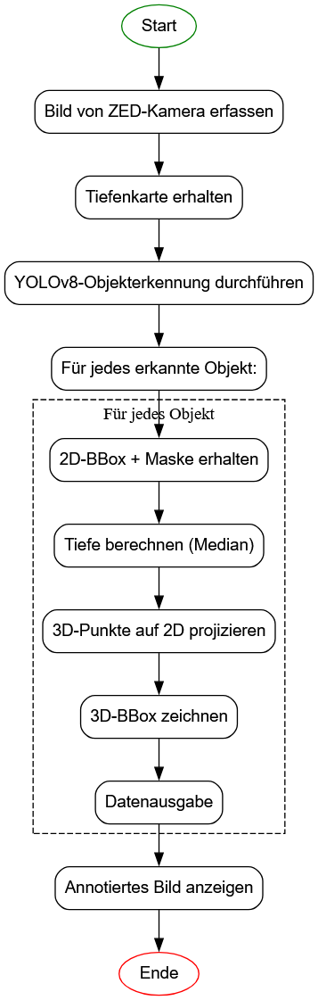

# 3D Objekterkennung mit YOLO auf dem Jetson Orin Nano

In diesem Projekt geht es um die Objekterkennung mit **YOLO (You Only Look Once)** auf dem **NVIDIA Jetson Orin Nano**.  
> Hinweis: Dieses Projekt ist Teil eines größeren Vorhabens. Daher kann es vorkommen, dass sich der Text auf andere Abschnitte bezieht oder bestimmte Begriffe nicht im Detail erklärt werden.

## 📁 Dokumentation

Dieses Repository enthält sowohl Installationsanleitungen als auch Beispiele und Ergebnisse der Objekterkennung.  
➡️ Weitere Informationen finden Sie im Ordner [**Doco**](./Doco).

## ⚙️ Programmablauf

## 📄 Weitere Details

Weiteres zur Objekterkennung und zu den Ergebnissen finden Sie in der [**PDF-Dokumentation**](docs/3d_detection_with_yolo.pdf).
